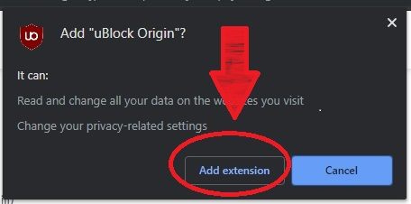

* หากมีโปรแกรมบล็อกโฆษณาตัวอื่นติดตั้งอยู่แล้วให้ทำการลบออกก่อน
* Chrome บนมือถือไม่รองรับกาติดตั้งส่วนเสริม ให้ใช้ Firefox แทน

* กดที่ [Link](https://chrome.google.com/webstore/detail/ublock-origin/cjpalhdlnbpafiamejdnhcphjbkeiagm) เพื่อไปยังหน้าส่วนเสริม และกดปุ่ม Add to chrome ทางมุมขวาบน

* กด Add extension

* จากนั้น <a href="abp:subscribe?location=https://adblock-thai.github.io/thai-ads-filter/subscription.txt&title=Thai Adblock List">กดที่นี่</a> เพื่อเพิ่มรายการไปยังส่วนเสริม
* กด OK เป็นอันเสร็จสิ้น

