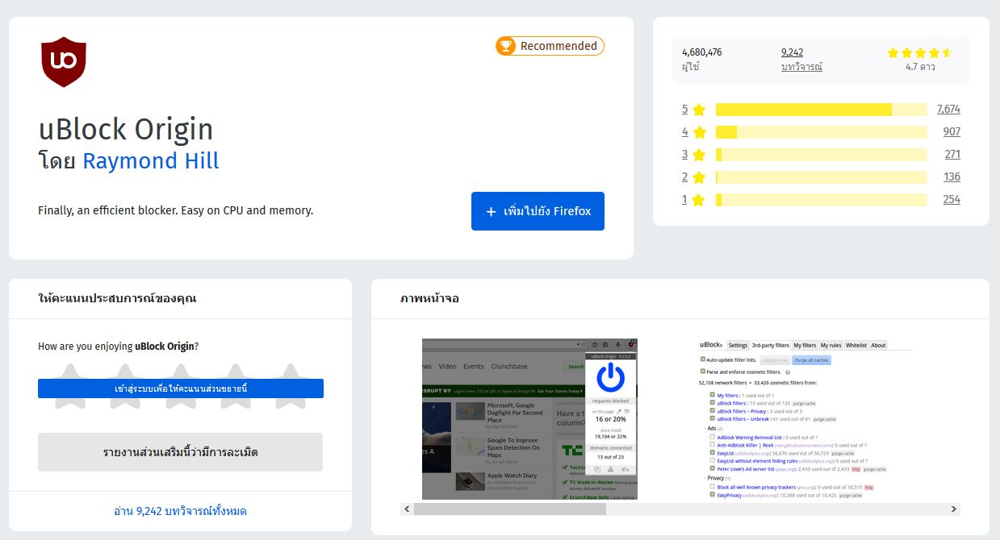
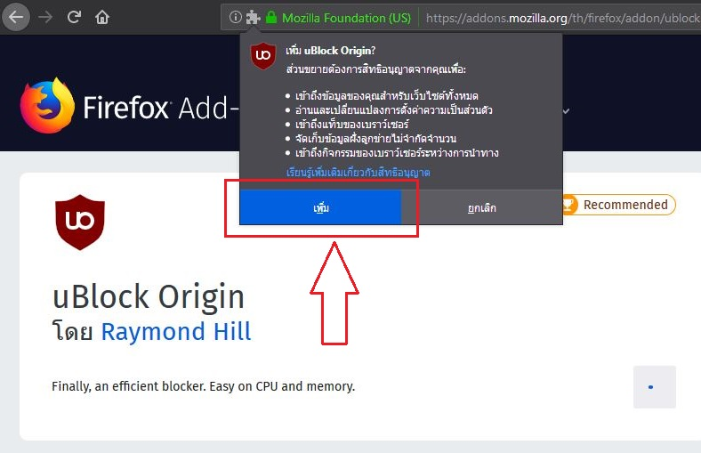
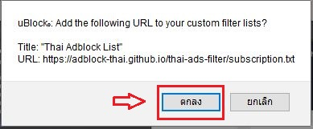

* กดที่ [Link](https://addons.mozilla.org/th/firefox/addon/ublock-origin/) เพื่อไปยังหน้าส่วนเสริม และกดปุ่ม เพิ่มไปยัง Firefox

* กด เพิ่ม เพื่อตยอมรับการติดตั้ง

* จากนั้นกด [ที่นี่](abp:subscribe?location=https://adblock-thai.github.io/thai-ads-filter/subscription.txt&title=Thai%20Adblock%20List) เพื่อเพิ่มรายการไปยังส่วนเสริม
* กด ตกลง เป็นอันเสร็จสิ้น

