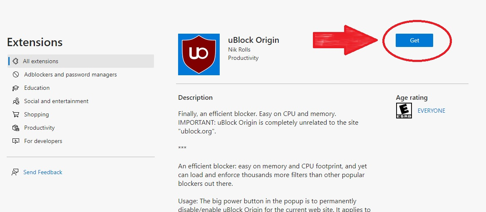
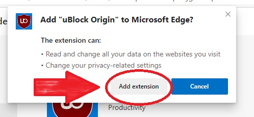
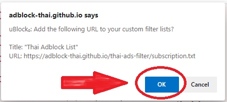

* ติดตั้ง Edge Chrome ได้ที่ [Microsoft Edge Chrome](https://www.microsoft.com/edge)

* หากมีโปรแกรมบล็อกโฆษณาตัวอื่นติดตั้งอยู่แล้วให้ทำการลบออกก่อน

* กดที่ [Link](https://microsoftedge.microsoft.com/addons/detail/ublock-origin/odfafepnkmbhccpbejgmiehpchacaeak) เพื่อไปยังหน้าส่วนเสริม และกดปุ่มติดตั้ง/เพิ่ม

* กด เพิ่ม เพื่อยอมรับการติดตั้ง

* จากนั้น <a href="abp:subscribe?location=https://adblock-thai.github.io/thai-ads-filter/subscription.txt&title=Thai Adblock List">กดที่นี่</a> เพื่อเพิ่มรายการไปยังส่วนเสริม
* กด ตกลง เป็นอันเสร็จสิ้น

